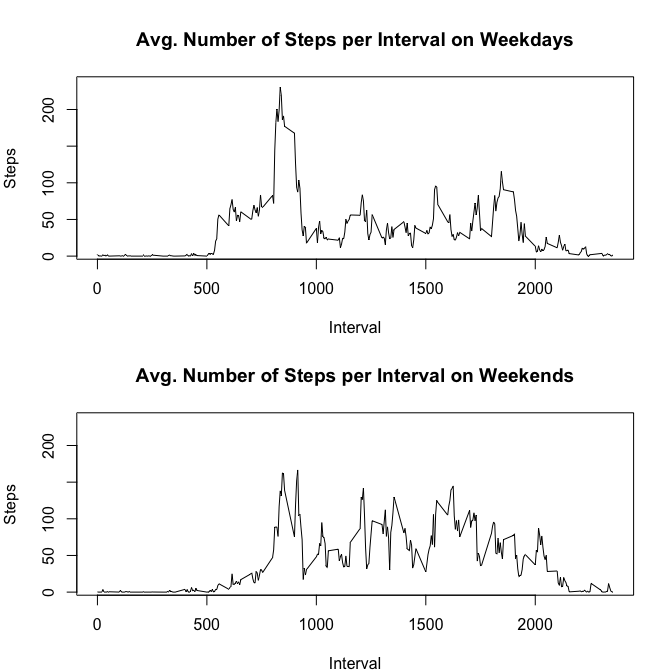

## Loading and preprocessing the data

The data set is unzipped (unless already unzipped before) and loaded as a CSV file.
The dates are parsed into days using 'ymd' of the 'lubridate' package.


```r
if (!file.exists("activity.csv")) {
    unzip("activity.zip") 
}
activityData <- read.csv("activity.csv")
activityData <- mutate(activityData,
                       date = ymd(date))
```

## What is mean total number of steps taken per day?

The activity data is grouped by days and the total number of steps is 
calculated for each day (ignoring missing values):


```r
# Calculate the total number of steps for each day and the overall mean and average
activityDataPerDay <- group_by(activityData, date) %>%
    summarise(totsteps = sum(steps, na.rm = TRUE))
meanTotSteps <- mean(activityDataPerDay$totsteps, na.rm = TRUE)
medianTotSteps <- median(activityDataPerDay$totsteps, na.rm = TRUE)
```

The histogram shows the total number of steps per day. The overall mean 
(**9354 steps**) and 
median (**10395 steps**) 
are shown with a vertical blue/red dashed line.


```r
hist(activityDataPerDay$totsteps, main = "Total Number of Steps per Day", 
     xlab = "Steps per Day")
abline(v = meanTotSteps, col = "blue", lty = 2)
abline(v = medianTotSteps, col = "red", lty = 2)
legend("topright", col = c("blue", "red"), lty = 2,
       legend = c(paste("Mean:", format(meanTotSteps, digits = 0, scientific = FALSE), "steps"), 
                  paste("Median:", format(medianTotSteps, digits = 0, scientific = FALSE), "steps")))
```

<!-- -->


## What is the average daily activity pattern?

The activity data is grouped by each interval and the average number of steps is 
calculated for each interval (ignoring missing values):


```r
# Calculate the total number of steps for each day
activityDataPerInterval <- group_by(activityData, interval) %>%
    summarise(meanSteps = mean(steps, na.rm = TRUE))
# retrieve the record with the maximum number of steps
maxSteps <- activityDataPerInterval[which.max(activityDataPerInterval$meanSteps),]
```

The time series plot shows the average number of steps for each interval. 
The interval **835** has the maximum number of steps: 
**206**


```r
plot(activityDataPerInterval$interval, activityDataPerInterval$meanSteps, type = "l",
     main = "Avg. Number of Steps per Interval", xlab = "Interval", ylab = "Steps")
abline(v = maxSteps$interval, col = "blue", lty = 2)
legend("topright", col = "blue", lty = 2,
       legend = paste("Max: interval", maxSteps$interval, "with", 
                      format(maxSteps$meanSteps, digits = 0, scientific = FALSE), "steps"))
```

<!-- -->

## Imputing missing values

The initial data set has **2304 missing values**.

To analyze the impact of ignoring those missing values in the previous calculations, 
a new data set is created in which the missing values are replaces with the 
average number of steps for the corresponding interval. Second the total number
of steps for each day and the overall mean/median are calculated.


```r
imputedActivityData <- mutate(activityData,
                              steps = ifelse(is.na(steps), 
                                             activityDataPerInterval$meanSteps, 
                                             steps))
imputedActivityDataPerDay <- group_by(imputedActivityData, date) %>%
    summarise(totsteps = sum(steps, na.rm = TRUE))
meanImputedTotSteps <- mean(imputedActivityDataPerDay$totsteps)
medianImputedTotSteps <- median(imputedActivityDataPerDay$totsteps)
```

The histogram shows the new total number of steps per day. The overall mean 
(**10766 steps**) and 
median (**10766 steps**) 
are again shown with a vertical blue/red dashed line.


```r
hist(imputedActivityDataPerDay$totsteps, main = "Total Number of Steps per Day", 
     xlab = "Steps per Day")
abline(v = meanImputedTotSteps, col = "blue", lty = 2)
abline(v = medianImputedTotSteps, col = "red", lty = 2)
legend("topright", col = c("blue", "red"), lty = 2,
       legend = c(paste("Mean:", format(meanImputedTotSteps, digits = 0, scientific = FALSE), "steps"), 
                  paste("Median:", format(medianImputedTotSteps, digits = 0, scientific = FALSE), "steps")))
```

<!-- -->

If we compare the results with the imputed data with the results of the initial data set, 
we see that the total number of steps has decreased in the first 2 bars (0-5000 and 5000-10000 steps).
The reason being that the missing data is in intervals with little activity and the 
imputed small numbers lower the total sum.

## Are there differences in activity patterns between weekdays and weekends?

The compare the activity patterns between weekdays and weekends, a new factor
variable is added to the data set with values "weekend" / "weekday" (depending
on whether the day is a weekday or a weekend). The data is grouped by day and the
new factor variable and aggregated by averaging the number of steps.
Finally 2 subsets are created, one for weekdays and one for weekends.


```r
# add factor variable 
imputedActivityData <- mutate(imputedActivityData,
                              typeOfDay = as.factor(ifelse(weekdays(imputedActivityData$date) %in% c("Saturday", "Sunday"), 
                                                    "weekend", "weekday")))
imputedActivityDataPerInterval <- group_by(imputedActivityData, interval, typeOfDay) %>%
    summarise(meanSteps = mean(steps, na.rm = TRUE))
imputedActivityDataPerIntervalWeekday <- subset(imputedActivityDataPerInterval, typeOfDay == "weekday")
imputedActivityDataPerIntervalWeekend <- subset(imputedActivityDataPerInterval, typeOfDay == "weekend")
```

If we plot the activity on weekdays compared to the activity on weekends we see
that the activity increases later on weekends than on weekdays (people staying 
longer in bed ;>)) but is higher during the day (people being more active).


```r
par(mfrow = c(2, 1), mar = c(4, 4, 4, 2))
yLim <- c(0, max(imputedActivityDataPerIntervalWeekday$meanSteps, imputedActivityDataPerIntervalWeekend$meanSteps)) + 5
# plot for weekdays
with(imputedActivityDataPerIntervalWeekday, 
     plot(interval, meanSteps, type = "l", ylim = yLim, 
          main = "Avg. Number of Steps per Interval on Weekdays", 
          xlab = "Interval", ylab = "Steps"))
# plot for weekends
with(imputedActivityDataPerIntervalWeekend, 
     plot(interval, meanSteps, type = "l", ylim = yLim, 
          main = "Avg. Number of Steps per Interval on Weekends", 
          xlab = "Interval", ylab = "Steps"))
```

<!-- -->
