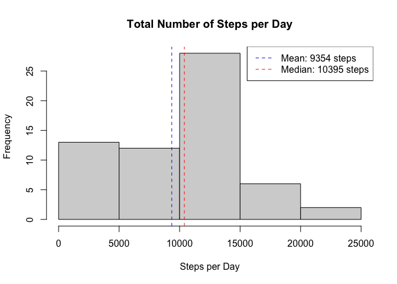
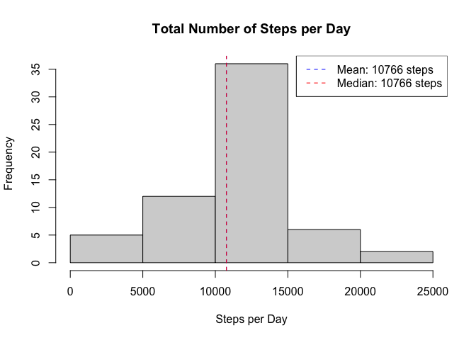

## Loading and preprocessing the data

The data set is unzipped (unless already unzipped before) and loaded as a CSV file.
The dates are parsed into days using 'ymd' of the 'lubridate' package.


```r
if (!file.exists("activity.csv")) {
    unzip("activity.zip") 
}
activityData <- read.csv("activity.csv")
activityData <- mutate(activityData,
                       date = ymd(date))

summary(activityData)
```

```
##      steps             date               interval     
##  Min.   :  0.00   Min.   :2012-10-01   Min.   :   0.0  
##  1st Qu.:  0.00   1st Qu.:2012-10-16   1st Qu.: 588.8  
##  Median :  0.00   Median :2012-10-31   Median :1177.5  
##  Mean   : 37.38   Mean   :2012-10-31   Mean   :1177.5  
##  3rd Qu.: 12.00   3rd Qu.:2012-11-15   3rd Qu.:1766.2  
##  Max.   :806.00   Max.   :2012-11-30   Max.   :2355.0  
##  NA's   :2304
```

## What is mean total number of steps taken per day?

The activity data is grouped by days and the total number of steps is 
calculated for each day (ignoring missing values):


```r
# Calculate the total number of steps for each day and the overall mean and average
activityDataPerDay <- group_by(activityData, date) %>%
    summarise(totsteps = sum(steps, na.rm = TRUE))
meanTotSteps <- mean(activityDataPerDay$totsteps, na.rm = TRUE)
medianTotSteps <- median(activityDataPerDay$totsteps, na.rm = TRUE)
```

The histogram shows the total number of steps per day. The overall mean 
(**9354 steps**) and 
median (**10395 steps**) 
are shown with a horizontal blue/red dashed line.


```r
plot(activityDataPerDay$date, activityDataPerDay$totsteps, type = "h",
     main = "Total Number of Steps per Day", xlab = "", ylab = "Steps")
abline(h = meanTotSteps, col = "blue", lty = 2)
abline(h = medianTotSteps, col = "red", lty = 2)
legend("topright", col = c("blue", "red"), lty = 2,
       legend = c(paste("Mean:", format(meanTotSteps, digits = 0, scientific = FALSE)), 
                  paste("Median:", format(medianTotSteps, digits = 0, scientific = FALSE))))
```

<!-- -->


## What is the average daily activity pattern?

The activity data is grouped by each interval and the average number of steps is 
calculated for each interval (ignoring missing values):


```r
# Calculate the total number of steps for each day
activityDataPerInterval <- group_by(activityData, interval) %>%
    summarise(meanSteps = mean(steps, na.rm = TRUE))
# retrieve the record with the maximum number of steps
maxSteps <- activityDataPerInterval[which.max(activityDataPerInterval$meanSteps),]
```

The time series plot shows the average number of steps for each interval. 
The interval **835** has the maximum number of steps: 
**206**


```r
plot(activityDataPerInterval$interval, activityDataPerInterval$meanSteps, type = "l",
     main = "Avg. Number of Steps per Interval", xlab = "Interval", ylab = "Steps")
abline(v = maxSteps$interval, col = "blue", lty = 2)
legend("topright", col = "blue", lty = 2,
       legend = paste("Max: interval", maxSteps$interval, "with", 
                      format(maxSteps$meanSteps, digits = 0, scientific = FALSE), "steps"))
```

<!-- -->

## Imputing missing values

The initial data set has **2304 missing values**.

To analyze the impact of ignoring those missing values in the previous calculations, 
a new data set is created in which the missing values are replaces with the 
average number of steps for the corresponding interval. Second the total number
of steps for each day and the overall mean/median are calculated.


```r
imputedActivityData <- mutate(activityData,
                              steps = ifelse(is.na(steps), 
                                             activityDataPerInterval$meanSteps, 
                                             steps))
imputedActivityDataPerDay <- group_by(imputedActivityData, date) %>%
    summarise(totsteps = sum(steps, na.rm = TRUE))
meanImputedTotSteps <- mean(imputedActivityDataPerDay$totsteps)
medianImputedTotSteps <- median(imputedActivityDataPerDay$totsteps)
```

The histogram shows the imputed total number of steps per day. The overall mean 
(**10766 steps**) and 
median (**10766 steps**) 
are shown with a horizontal blue/red dashed line.


```r
plot(imputedActivityDataPerDay$date, imputedActivityDataPerDay$totsteps, type = "h",
     main = "Total Number of Steps per Day", xlab = "Day", ylab = "Steps")
abline(h = meanImputedTotSteps, col = "blue", lty = 2)
abline(h = medianImputedTotSteps, col = "red", lty = 2)
legend("topright", col = c("blue", "red"), lty = 2,
       legend = c(paste("Mean:", format(meanImputedTotSteps, digits = 0, scientific = FALSE)), 
                  paste("Median:", format(medianImputedTotSteps, digits = 0, scientific = FALSE))))
```

<!-- -->

If we compare the imputed results with the results of the initial data set, 
we see that the total number of steps has increased in the first 2 quantiles; 
the reason is (most likely) that data was missing in the nighttime hours.


```r
summary(activityDataPerDay$totsteps)
```

```
##    Min. 1st Qu.  Median    Mean 3rd Qu.    Max. 
##       0    6778   10395    9354   12811   21194
```

```r
summary(imputedActivityDataPerDay$totsteps)
```

```
##    Min. 1st Qu.  Median    Mean 3rd Qu.    Max. 
##      41    9819   10766   10766   12811   21194
```

## Are there differences in activity patterns between weekdays and weekends?

The compare the activity patterns between weekdays and weekends, a new factor
variable is added to the data set with values "weekend" / "weekday" (depending
on whether the day is a weekday or a weekend) and 2 subsets are created, one for
each factor level.


```r
# add factor variable 
imputedActivityData <- mutate(imputedActivityData,
                              typeOfDay = as.factor(ifelse(weekdays(imputedActivityData$date) %in% c("Saturday", "Sunday"), 
                                                    "weekend", "weekday")))
imputedActivityDataPerInterval <- group_by(imputedActivityData, interval, typeOfDay) %>%
    summarise(meanSteps = mean(steps, na.rm = TRUE))
imputedActivityDataPerIntervalWeekday <- subset(imputedActivityDataPerInterval, typeOfDay == "weekday")
imputedActivityDataPerIntervalWeekend <- subset(imputedActivityDataPerInterval, typeOfDay == "weekend")
```

If we plot the activity on weekdays compared to the activity on weekends we see
that the activity increases later on weekends than on weekdays (people staying 
longer in bed ;>)) but is higher during the day.


```r
par(mfrow = c(2, 1), mar = c(4, 4, 4, 2))
yLim <- c(0, max(imputedActivityDataPerIntervalWeekday$meanSteps, imputedActivityDataPerIntervalWeekend$meanSteps)) + 5
# plot for weekdays
with(imputedActivityDataPerIntervalWeekday, 
     plot(interval, meanSteps, type = "l", ylim = yLim, 
          main = "Avg. Number of Steps per Interval on Weekdays", 
          xlab = "Interval", ylab = "Steps"))
# plot for weekends
with(imputedActivityDataPerIntervalWeekend, 
     plot(interval, meanSteps, type = "l", ylim = yLim, 
          main = "Avg. Number of Steps per Interval on Weekends", 
          xlab = "Interval", ylab = "Steps"))
```

<!-- -->


```r
summary(imputedActivityDataPerIntervalWeekday$meanSteps)
```

```
##    Min. 1st Qu.  Median    Mean 3rd Qu.    Max. 
##   0.000   2.247  25.803  35.611  50.854 230.378
```

```r
summary(imputedActivityDataPerIntervalWeekend$meanSteps)
```

```
##    Min. 1st Qu.  Median    Mean 3rd Qu.    Max. 
##   0.000   1.241  32.340  42.366  74.654 166.639
```
